# Quadrotor Navigation in Urban Canyons  

---

## Introduction

The increasing deployment of quadrotors in urban environments for applications such as surveillance, delivery, and emergency response raises the need for precise trajectory tracking. 
- Urban canyons, formed by tall buildings lining narrow streets, create challenging flight conditions.
- These environments generate turbulent wind flows with vortices, gusts, and strong aerodynamic disturbances.
- Accurate trajectory tracking becomes difficult due to unpredictable urban wind dynamics with traditional controllers like PI, PID.
- This project aims to explore MPC, LQOC, and Pole Placement controllers for improved trajectory tracking.

---

## Mathematical Model

**Quadrotor Dynamics:**

$$
\begin{bmatrix} f^w \\ \tau^B \end{bmatrix} =
\begin{bmatrix} mI_3 & 0 \\ 0 & \mathcal{J} \end{bmatrix}
\begin{bmatrix} a^w \\ \alpha^B \end{bmatrix}
+
\begin{bmatrix} -mg^w \\ \omega^B \times \mathcal{J} \omega^B \end{bmatrix}
$$

- $f^w$: Forces in world frame  
- $\tau^B$: Torques in body frame  
- $m$: Mass  
- $\mathcal{J}$: Inertia matrix  
- $a^w$: Translational acceleration  
- $\alpha^B$: Angular acceleration  
- $\omega^B$: Angular velocity
  
Also,

- $\tau^B = \tau^B_{drag} + \tau^B_{thrust}$  
- $f^B_{thrust} = \sum_{i=1}^{4} R^B_{P_i} T^{P_i}$  
- $\tau^B_{thrust} = \sum_{i=1}^{4} (\rho_i^B \times R^B_{P_i} T^{P_i})$  

---

**Final Quadrotor Dynamics:**

$$
\begin{bmatrix}
m \dot{v}^w \\
\mathcal{J} \dot{\omega}^B
\end{bmatrix} =
\begin{bmatrix}
-mg e_3 \\
-\omega^B \times \mathcal{J} \omega^B
\end{bmatrix} +
\begin{bmatrix}
R^w_B & 0 \\
0 & I_3
\end{bmatrix}
F^w
$$

Also:  
- $\dot{p}^w = v^w$  
- $\dot{R}^w_B = R^w_B [\omega^B]^\wedge$

---

## Wind Model (Dryden)

Wind disturbance modeled using Dryden:

$$
\begin{align*}
\dot{W}_u &= -\frac{W_u}{L_u} + \frac{\sigma_u}{\sqrt{L_u}} G_u \\
\dot{W}_v &= -\frac{W_v}{L_v} + \frac{\sigma_v}{\sqrt{L_v}} G_v \\
\dot{W}_w &= -\frac{W_w}{L_w} + \frac{\sigma_w}{\sqrt{L_w}} G_w
\end{align*}
$$

- $W_{u,v,w}$: Wind disturbances  
- $L_{u,v,w}$: Turbulence scales  
- $\sigma_{u,v,w}$: Intensities  
- $G_{u,v,w}$: White noise inputs

---

## Disturbance Simulation

- Simulated for 10s from 1m to 500m altitude  
- Mean velocity: 2 m/s @ 0m, increases 0.02 per meter  
- Turbulence intensity ∝ velocity  
- Length scales: constant

---

## Wind Graphs

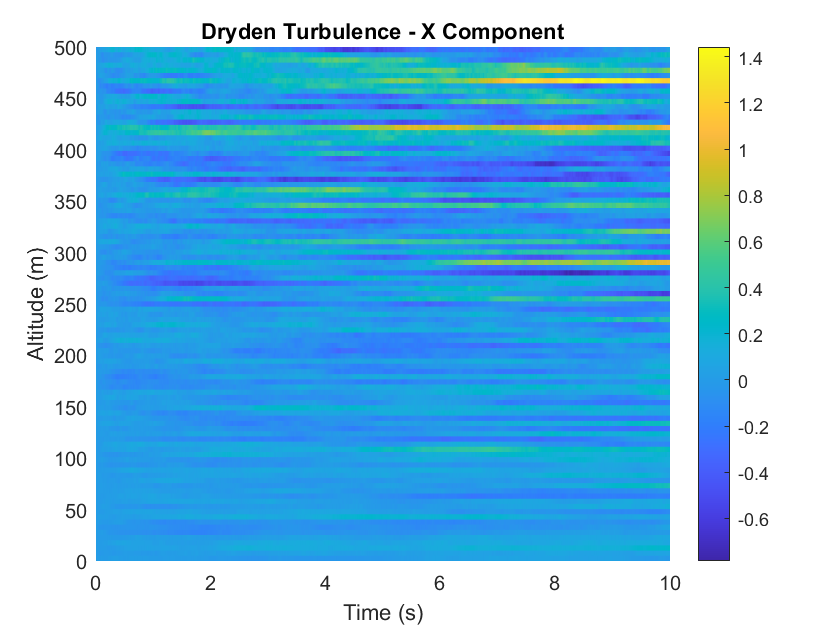  
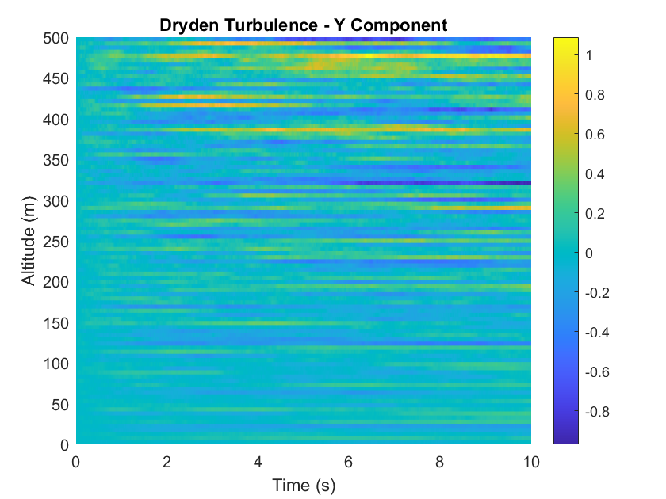  
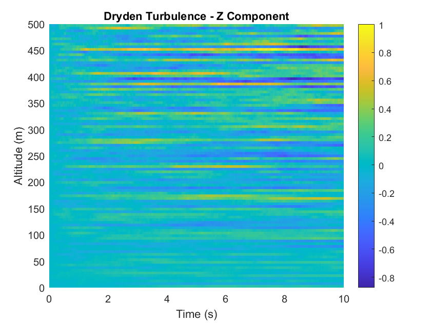

---

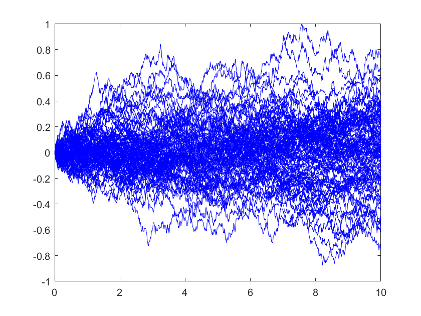  
*Wind velocity over time*

---

## Data Values

**Drone Parameters:**

- $m = 1.26$ kg  
- $g = 9.81$ m/s²  
- $J = diag(0.0347,\ 0.0457,\ 0.0977)$  
- $L = 0.225$ m  
- $k_f = 2.98$  
- $k_m = 1.14 \times 10^{-7}$  
- $C_d = 0.2$  
- $\rho = 1.225$ kg/m³  
- $A = 0.05$ m²

---

## Trajectory

**Initial:**

- $x = 0$, $y = 0$, $z = 10$ m  
- $\phi = 0$, $\theta = 5^\circ$, $\psi = 0$  
- $r = 0.1$ rad/s  

**Setpoint:**

- $x_{ref}(t) = 0$  
- $y_{ref}(t) = 0$  
- $z_{ref}(t)$: 10 to 30 m

---

## Open Loop Simulation

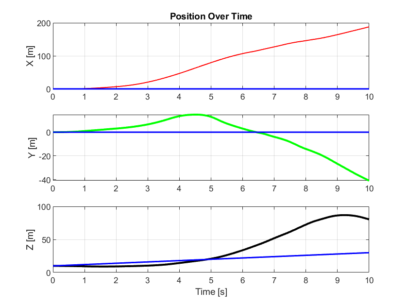 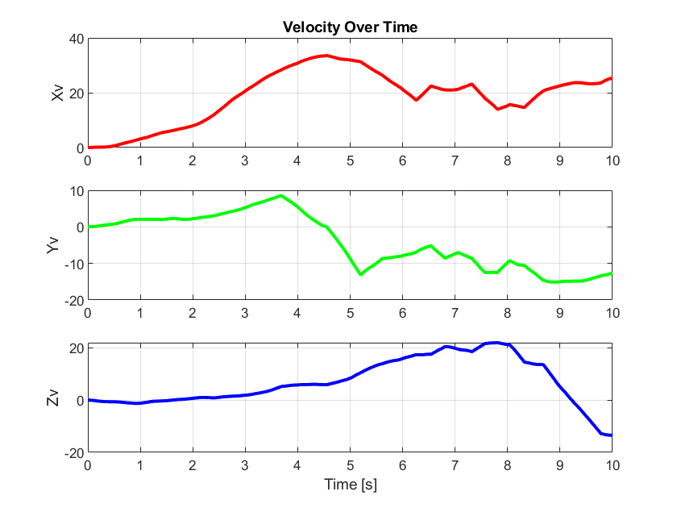

---

  
*Blue = Desired, Pink = Actual*

---

## System Performance

**Step Info:**

- Rise Time: 5.55s  
- Overshoot: 189.58%  
- Peak: 86.87  
- Peak Time: 9.22s  
- Settling Range: [27.02, 86.87]  
- No undershoot

---

## Observability & Reachability

- Sampling time $T_s = 0.1$ s  
- Rank of observability & reachability matrices = 12  
→ System is **fully observable and reachable**

---

## Observer Simulation

- **Luenberger Observer** for state  
- **Innovation bias** for disturbance

**SSEi (states):** `1e-15`  
- Example: 0.0251, 0.0044, 0.1395  

**SSEi (disturbance):** `1e-3`  
- Example: 0.2270, 0.1102, 0.5785

---

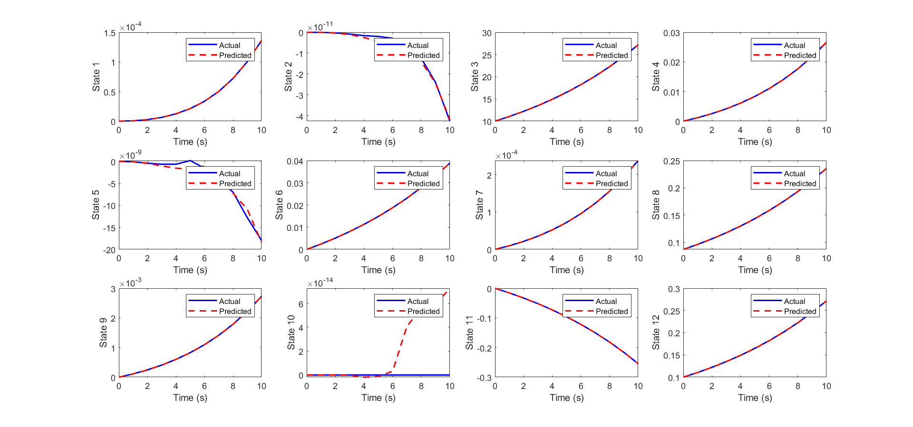

---

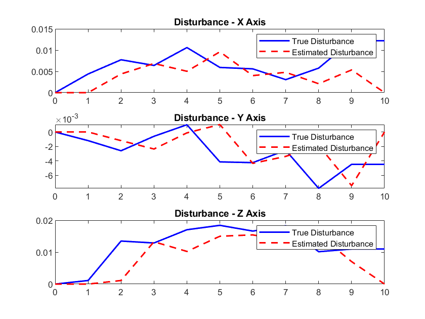

---

## Pole Placement Controller

**Control Input:**
- 0-1s: $U = [1.015;\, 0;\, 0;\, 0]$  
- Post 1s: $U = 1.0129 \times \mathbf{1}$  

**Update:**
- $X_{i+1} = \phi\, \hat{x}_i + \gamma_U\, U_i + \gamma_D\, \hat{d}_i$  
- $U_{i+1} = -G \cdot X_i$

---

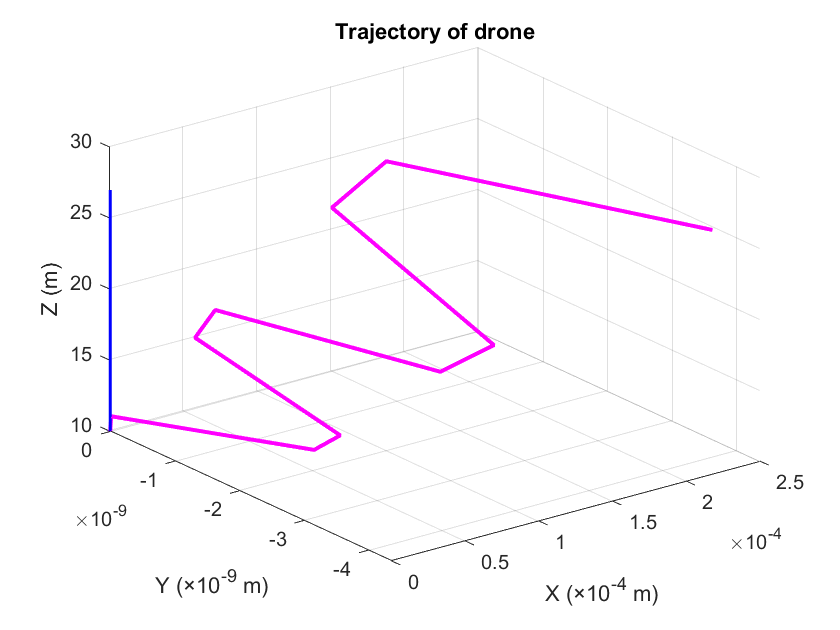  
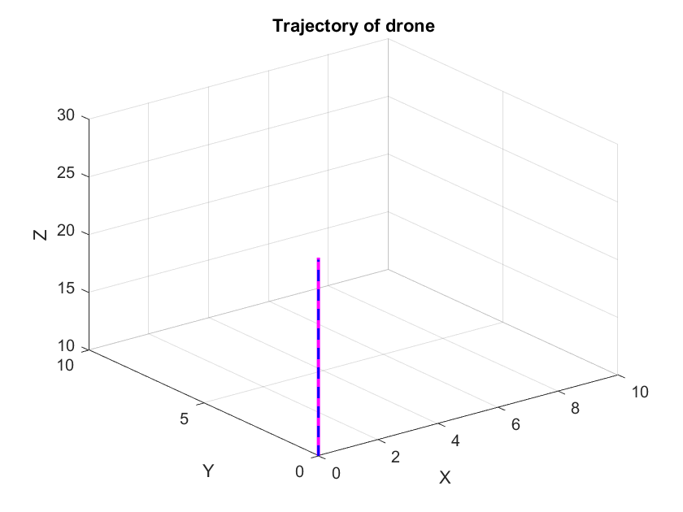

---

## LQOC Controller

**LQ Control Law:**

$$
U_{i+1} = -G_\infty \cdot X_i
$$

Where:  
- $G_\infty = \gamma_U^\dagger (\phi - I)$  
- Cost: $J = \sum (X^T W_x X + U^T W_u U)$  
- $W_x = I_{12}$, $W_u = 0.1 I_4$

---

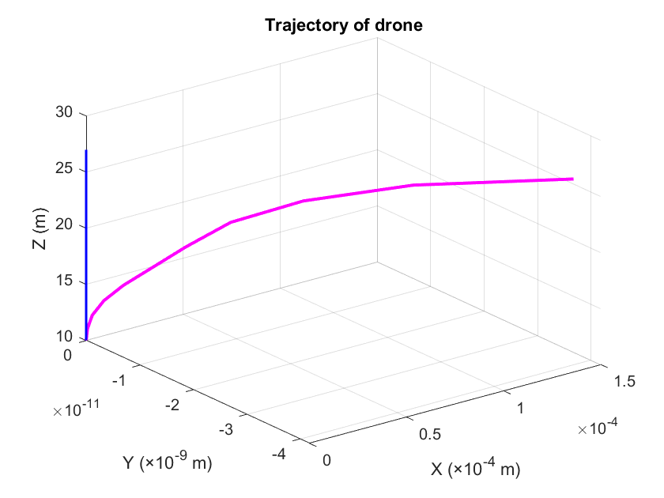  
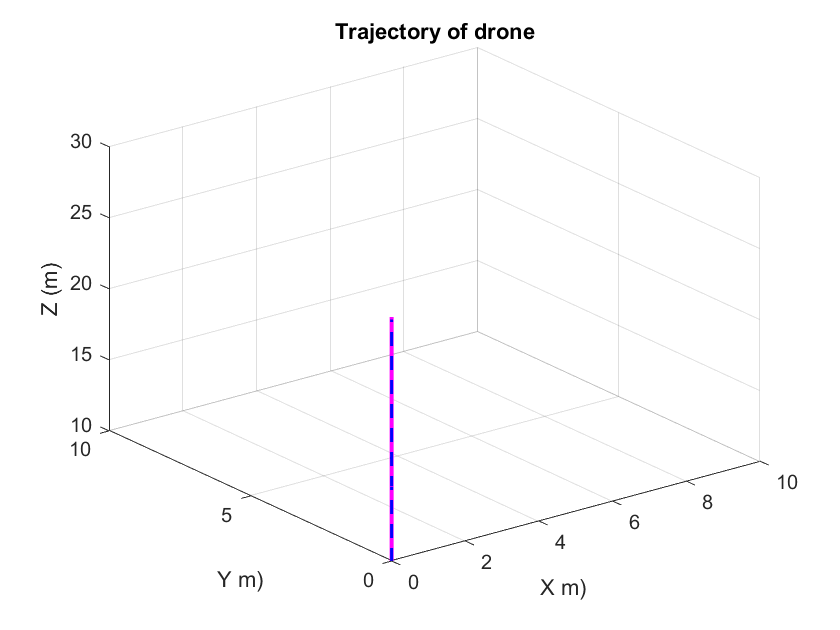

---

## MPC Controller

**Parameters:**

- $N_p = 5$, $N_c = 3$  
- $W_x = I_{12}$, $W_u = 0.1 I_4$  

**QP Objective:**

$$
\min_{\Delta U} \frac{1}{2} \Delta U^T H \Delta U + f^T \Delta U
$$

Constraints via $A_{eq}, b_{eq}$

---

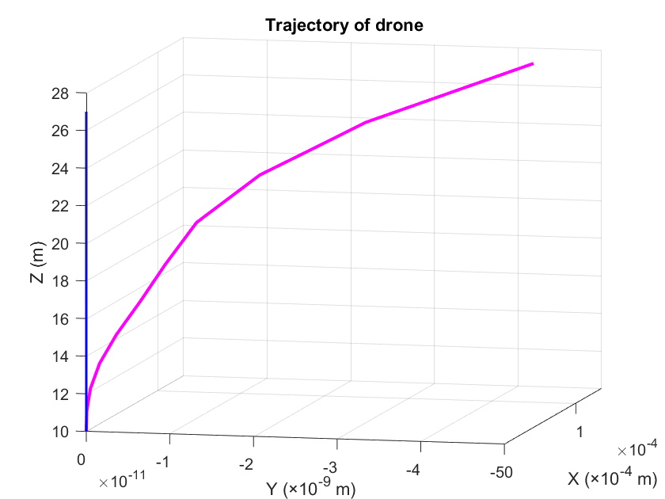  

---

## Comparison Table

| State | PPC | LQOC | MPC |
|-------|-----|------|-----|
| X     | 1.3e-07 | 3.8e-08 | 3.8e-08 |
| Y     | 4.6e-17 | 1.5e-19 | 1.5e-19 |
| Z     | 21.33   | 21.34   | 21.34   |

→ Minimal lateral error; Z offset due to thrust overcompensation.  
→ LQOC = best for vertical tracking.

---

## Manipulated Inputs

**SSMV (PPC):**  
`-1.0150  346.64 383.17 ... 816.92`

**SSMV (LQOC):**  
`-1.0100 -1.2239 ... -2.7713`

**SSMV (MPC):**  
`-1.0346 -1.0639 ... -1.0100`

---

